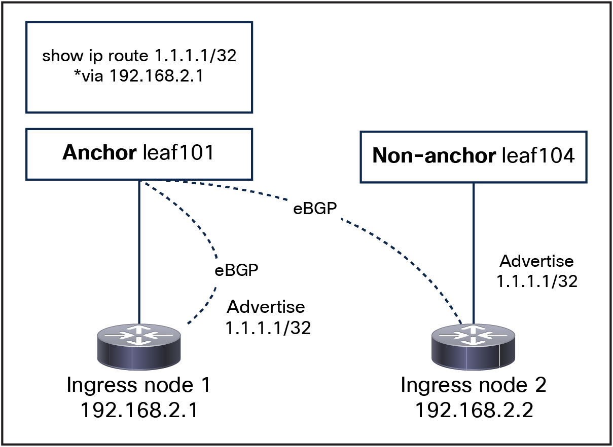

# ACI BGP Design
Regardless if the Simplicity Design or the Advanced Design is used the ACI BGP configuration is largely identical. 

The Goal of our ACI fabric is to provide reliable transport and security to our Kubernetes infrastructure. As covered in the [ACI Designs](../aci_designs) section, ACI will need to be configured with a Bridge Domain and L3Out to provide connectivity to our clusters. 

## L3Out physical connectivity

There is no strict requirement of the physical connectivity for the L3Out as long as it provides the required redundancy level. Having L2 redundancy improves failover times as there is no need to wait for BGP convergence.

This design implements L3 connectivity with the use of the floating SVI feature. This feature allows us to configure an L3Out without specifying logical interfaces, thus removing the need to configure multiple L3Out logical interfaces to maintain routing when VMs move from one host to another. Floating SVI is supported for VMware vSphere Distributed Switch (VDS) as of Cisco ACI Release 4.2(1) and on physical domains as of Cisco ACI Release 5.0(1). It is recommended to use physical domains for the following reasons:

* It can support any hypervisor.
* It can support mixed mode clusters (VMs and bare-metal).

This is not a strict requirement, and, if all nodes are running in a VMware environment, there are no technical reasons not to use VMM integration.
Using floating SVI also relaxes the requirement of not having any Layer-2 communications between the `nodes`; this allows the design to use:

* A single subnet for all the `nodes`
* A single encapsulation (VLAN) for all the `nodes`

### BGP Dynamic Neighbors

All the `nodes` configured for BGP peering will share the same AS number. By sharing the same AS number, we can use the BGP Dynamic Neighbors capability, which allows for the dynamic and automated establishment of peering sessions between routers. Instead of requiring manual configuration of individual neighbor statements for each peer, this feature utilizes a `listener` (in our case, the ACI fabric) to accept incoming BGP connections from a predefined IP subnet.

### BGP Peering with ACI prior to 6.1(2):

In ACI software releases prior to 6.1(2), it is required to either:
* peer the `ingress nodes` only with directly attached anchor nodes
* peer the `ingress nodes` only with NON directly attached anchor nodes

This is required because routes generated by nodes directly connected to the anchor nodes are preferred over routes from nodes not directly connected to the anchor nodes, and this could lead to nodes not being utilized.

For example: if we expose a service with IP `1.1.1.1` via BGP, anchor `leaf101` will only install one ECMP path for `1.1.1.1/32` through `192.168.2.1`, because the locally attached route is preferred, even though multiple nodes could be providing this service.

*Pre ACI 6.1(2) limitation*
 
This limitation is removed in ACI 6.1(2) and it is therefore strongly recommended to use ACI 6.1(2) or newer.

### Next Hop Propagate and Ignore IGP Metric - ACI 6.1(2)+ Required

{: .warning } 
These two features are recommended for the *Simplicity Design* and a **requirement** for the *Advanced Design*.

If an external router is physically connected to a non-anchor leaf node, traffic from a Cisco ACI internal endpoint to an external destination is routed through an anchor leaf node before reaching the external router via the non-anchor leaf node. This creates a suboptimal traffic path. Additionally, as mentioned earlier, routes from nodes directly connected to anchor nodes are preferred over those from nodes not directly connected, potentially leading to underutilization of certain nodes.

Both of the above issues can be removed by enabling these two features:

* Next-hop propagation: this configuration is applied only to the anchor leaf nodes and enables them to redistribute the external prefixes inside the Cisco ACI fabric with the next-hop IP address of the external router announcing these external prefixes. That way, the compute leaf nodes receives and install in their forwarding tables the external prefixes with the external router's IP address (In our case the Cilium Ingress Gateway) as the next-hop.

* Ignore IGP Metric: When you configure this option the BGP best path algorithm does not consider the IGP metric of the Next Hop resulting in both Anchor and Non-Anchor connected nodes to be selected as next hops ensure all the K8s nodes are used.

Note that the Next Hop Propagate feature was introduced in ACI release 5.0(1). However, until ACI 6.1(2) there was no support for Ignore IGP Metric and for this design to work both features are required. Configuring only Next Hop Propagate will not be sufficient and if you are running on ACI 6.1(1) or lower the recommendation is to simply connect the `ingress nodes` directly to the `ACI Anchor nodes`. 

### Max BGP ECMP path (optional)

By default, ACI installs up to 16 eBGP/iBGP ECMP paths. If more than 16 `nodes` are required, ACI can be configured to install up to 64 ECMP paths.

### BGP Graceful Restart

Both ACI and Cilium will be configured to use BGP Graceful Restart. When a BGP speaker restarts its BGP process or when the BGP process crashes, neighbors will not discard the received paths from the speaker, ensuring that connectivity is not impacted as long as the data plane is still correctly programmed.

### BFD With Isovalent Networking for Kubernetes 

Bidirectional Forwarding Detection (BFD) is a network protocol used to detect faults in the path between two forwarding engines, such as routers, and is commonly used in conjunction with routing protocols like BGP (Border Gateway Protocol). BFD enhances BGP operations by providing quick and reliable detection of link failures, enabling faster failover and improved network resilience. Thanks to this capability we can achieve sub second failure detection for our BGP Peering.

{: .warning }
If BFD is configured for sub-second failure detection and you are running virtual machines, a live migration may cause BFD to perceive the node as down. Consequently, the BGP session will be reset, leading to the withdrawal of all routes advertised by the affected node from the routing table.

### BGP hardening (optional)

To protect the ACI system against potential Kubernetes BGP misconfigurations, the following settings are recommended:

* Enable BGP password authentication
* Set the maximum AS limit to one:
  * Per the eBGP design, the AS path should always be one.
* Configure BGP import route control to accept only the expected external-services subnets.
* (Optional) Set a limit on the number of received prefixes from the nodes.

[Next](/cilium-dc-design/docs/aci/examples/aci_tested_scale/){: .btn }
{: .text-right }