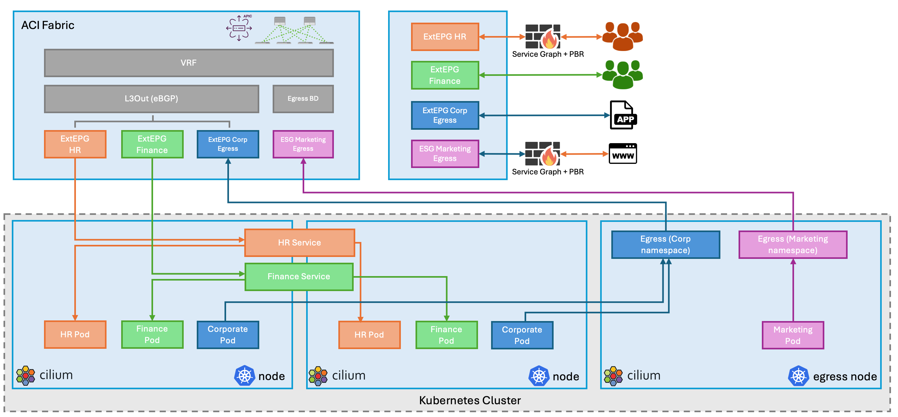

# Executive Summary
Application modernization is a growing trend, with many organizations refactoring or re-architecting existing applications to leverage cloud-native technologies for improved agility and scalability. However, a significant portion of applications remain in their legacy state due to various factors like complexity, cost, and risk aversion, resulting in a hybrid environment where both modernized and traditional applications coexist.

To effectively manage traffic between modernized, containerized workloads and legacy applications, a solution that bridges the gap between these environments is essential. Cisco ACI can provide network policy and connectivity for the legacy workloads, while Cilium manages the network policies within the Kubernetes clusters hosting the modernized applications. By leveraging the designs provided for ACI and Cilium, organizations can achieve consistent security and observability across both their legacy and cloud-native environments, ensuring seamless communication and control.

Within Kubernetes, Cilium excels at enforcing east-west network policies, controlling the communication between microservices and pods within the cluster. Leveraging eBPF technology, Cilium provides efficient and granular control over this internal traffic, allowing administrators to define policies that restrict which services can communicate with each other based on identity, labels, or other criteria. This east-west policy enforcement is crucial for securing Kubernetes environments, limiting the blast radius of potential security breaches, and ensuring compliance with regulatory requirements. Additionally, Cilium enhances observability by offering real-time insights into network traffic, enabling administrators to monitor and troubleshoot network behavior effectively.

The designs provided on this site strike a balance between robust security policies, service availability, and the need for seamless and optimal communication across diverse application architectures.

At a high level, the following traffic patterns are considered:

- **Node-to-node Communication.** This forms the foundation for much of the networking functionality within a Kubernetes cluster, enabling pods, services, and control plane components to interact effectively. Cilium Native Routing is a networking mode in Cilium where the network packets are directly routed between nodes using the Linux kernel's native routing capabilities, instead of relying on overlay networks like VXLAN. This still allows for all the benefits provided by eBPF while removing the encapsulation overhead, and offering improved performance. This is provided by an L3out or BD in ACI.

- **External Service Access.** In Kubernetes, a Service is an abstraction that defines a logical set of Pods and a policy by which to access them. It provides a stable IP address for accessing applications running in Pods, regardless of how those Pods are scaled or rescheduled. The IPs allocated to these services are deterministic. Each service is advertised to ACI via BGP as a /32 host route, which can easily be classified using external EPGs (ExtEPGs). This allows the user to apply contracts that control communication to the service, and where needed, apply service redirection to for example a Firewall. BGP is a well-established and highly scalable routing protocol. Advertising Kubernetes services via BGP allows you to easily scale your services and adapt to changing network conditions.

- **Egress Communication**, also known as Pod-initiated traffic. Pod-initiated traffic encompasses any network connection originating from a Kubernetes pod to external services, APIs, databases, or other resources. Pods in Kubernetes are ephemeral, meaning they can be created, destroyed, and rescheduled frequently. As a result, Pods receive dynamically assigned IP addresses. Relying on these IPs for security policies or auditing is unreliable because they change. Kubernetes typically uses Source Network Address Translation (SNAT) on the worker nodes to allow Pods to access external networks. SNAT replaces the Pod's IP address with the node's IP address. This means that external services only see the node's IP, losing the original identity and context of the Pod that initiated the traffic. Egress Gateways in Kubernetes provide controlled exit points for traffic leaving the cluster. High Availability (HA) for these egress gateways further enhances the reliability and resilience of this egress. Similar to Service IP allocation, allocating IP addresses to Egress Gateways is deterministic. A user can leverage Labels in Kubernetes to specify how Pods, or even entire Namespaces egress the cluster. By combining the deterministic characteristics of Egress Gateway and External EPGs or ESGs with IP Selectors, the user can apply granular control to which services Pods have access.

The illustration offers a simplified view of how policy can be applied to control north/south communication to and from a Kubernetes cluster. In this example, the HR users are able to access the HR application - but are first redirected to a firewall for inspection. The users of the Finance app do not have to pass through the firewall, and can only access the Finance services. Pods in the Corporate Namespace are able to access other application within the Datacenter, whereas Pods in the Marketing namespace only have access to the internet via a Firewall.

To summarize, the combination of Cisco Application Centric Infrastructure (ACI) and Cilium offers a unified solution for managing hybrid environments, bridging legacy and cloud-native applications:

- **Security and Observability**: ACI provides consistent security policies for legacy applications, while Cilium enforces granular network policies within Kubernetes clusters.

- **Traffic Control**: Cilium handles east-west traffic, optimizing internal communications, while ACI excels in north/south traffic management, ensuring precise control and the ability to insert services.

- **Service and Egress Management**: Deterministic external service access via BGP and controlled egress communication using Egress Gateways and ESGs enhance scalability and security.

[Next](/cilium-dc-design/docs/aci/simplicity_design/){: .btn }
{: .text-right }