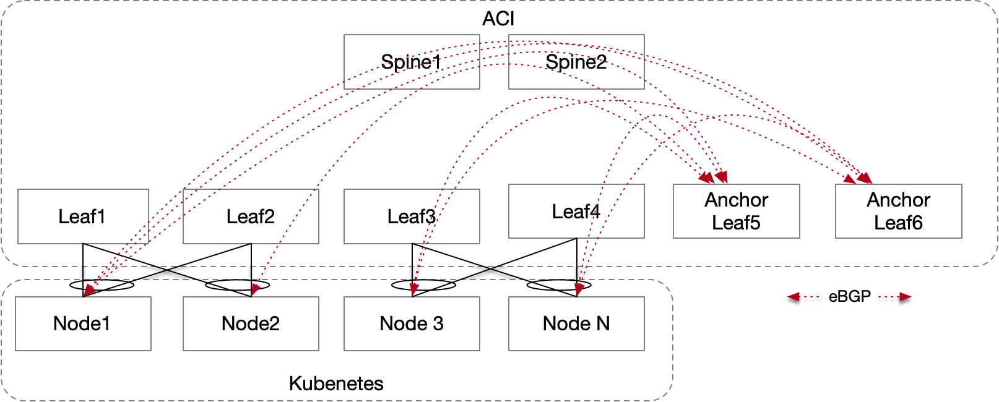
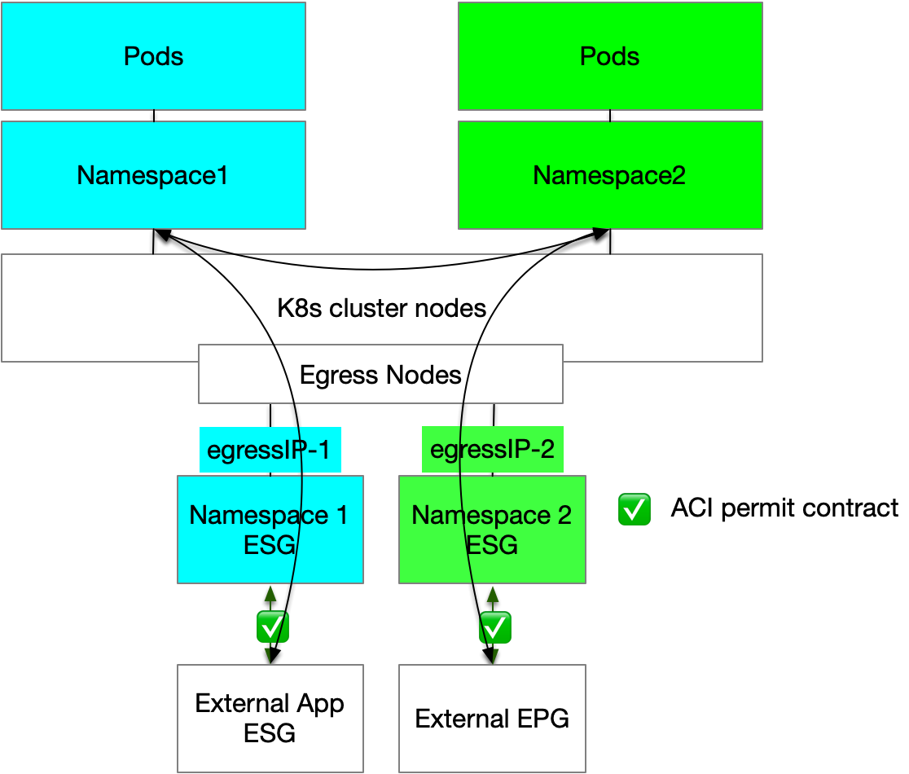

# Advanced Design

The basic network infrastructure for our design will be composed of the following components:

* A tenant: The Kubernetes cluster can be placed in any dedicated, or a shared tenant for deployments with multiple clusters.
* One Floating SVI L3Out where:
  * All the nodes are placed behind this L3Out which also provides a L2 Broadcast domain for Node-to-Node Communication
  * Dedicated Node External EPGs and Service EPGs are used for traffic classification and security with ACI Contracts
  * BGP Peering is established with all or a subset of the nodes for External Service advertisement and load balancing

* One Bridge Domain (BD) for the Egress Nodes
  * One EPG and multiple ESGs for the Kubernetes Egress Nodes interfaces. The ESGs will use IP selectors to map the `Egress IP` so that we can map different pods and or namespaces to different ESGs.

This design gives us the following capabilities:

* Secure the traffic to/from the cluster with ACI contracts.
* DHCP relay support: This design allows the Kubernetes nodes to be bootstrapped without the need to manually configure their IP addresses easing the cluster bootstrap and horizontal scalability. 

  {: .warning } 
  Please be aware of the DHCP relay limitations for L3outs. See: [DHCP Limitations](https://www.cisco.com/c/en/us/td/docs/dcn/aci/apic/6x/basic-configuration/cisco-apic-basic-configuration-guide-61x/provisioning-core-aci-fabric-services-61x.html#guidelines-and-limitations-for-a-dhcp-relay-policy)

* The nodes can be of any type and can be mixed: you can have a cluster composed of bare-metal hosts and VMs running on any hypervisor as long as network connectivity is provided.
* Routing simplicity: the node default gateway is the ACI Floating SVI IP.
* No need to advertise the POD subnet to ACI
* BGP based ECMP for External K8s service Load Balancing with Resilient Hashing
* Near optimal traffic flows thanks to [Direct Server Return](/cilium-dc-design/docs/fabric_agnostic_features/#direct-server-return)

## Cluster L3OUT physical connectivity

There is no strict requirement of the physical connectivity for the cluster EPG as long as it provides the required redundancy level. Most designs are likely to lean toward a vPC based design. Having L2 redundancy improves failover times as there is no need to wait for BGP convergence.

## BGP design
**Centralized BGP peering for service advertisement**

All Kubernetes nodes will peer with a single pair of leaf switches (also called anchor leaf switches), irrespective of their physical placement in the datacenter. This simplifies the configuration of the physical network and Cilium. At the time of writing ACI 6.1 [supports](https://www.cisco.com/c/en/us/td/cilium-dc-design/docs/dcn/aci/apic/6x/verified-scalability/cisco-aci-verified-scalability-guide-612.html) up to 2000 BGP peers per leaf. It is unlikely that this will pose a scale issue for a single Kubernetes cluster. 
In case multiple clusters are connected to the same network fabric, different pairs of anchor leafs can be used to distribute the resources.

Centralized Routing

### ECMP Considerations

* ACI installs up to 16 eBGP/iBGP ECMP paths. If more than 16 `nodes` are peering via BGP, ACI can be configured to install up to 64 ECMP paths.
* Maglev and DSR require the `externalTrafficPolicy` to be set to `Cluster`: This means that that every node that peers with ACI over BGP will advertise itself as a valid next hop for every exposed Service.
* The ECMP selection algorithm will install up to the configured number of ECMP per exposed service. If there are more ECMP paths available ACI will randomly ***(Not sure need to triple check)*** select next-hops with the same metric. This means that even if not all the nodes can be used for the service, traffic is still distributed fairly to all nodes running BGP. Furthermore since DSR is used, the response is sent back to the client directly from the pod, bypassing the original node that received the request. 

{: .note }
This design requires ACI 6.1(2) or above as the Propagate Next Hop and Ignore IGP Metric features are both needed.

## Isovalent Networking for Kubernetes Egress design

When it comes to the Cilium Egress design there are a two options we can evaluate based on our requirements. 

### Egress IP advertisement Over BGP (Preferred Option)

Cilium can Advertise the Egress IP over BGP. This can be done easily by adding in the `IsovalentBGPAdvertisement` CRD the `advertisementType: EgressGateway`
We can then use ACI external EPGs to classify the egress traffic and apply contracts to it. 

If ACI external EPGs scalability is an issue and a Firewall is anyway required we recommend using a single External EPG matching on the whole `EgressGateway` subnet and leverage Service Graph redirection to send the traffic to the Firewall.

This options keeps the design extremely simple and clean, all the nodes are identical and connect to ACI via a single L3OUT. 

### Egress IP and ESGs

We can harness the capabilities of ACI Endpoint Security Groups (ESGs) to develop an efficient network design with the following structure:

* Dedicated ESGs for Egress Gateway Traffic: The nodes performing egress will be configured with an additional Subnet that can be then classified into ESGs 
* Cilium Egress Gateway Policies: Implement Cilium Egress Gateway policies to associate specific namespaces with designated gateway nodes, each with a fixed egress IP address. This mapping ensures consistent and predictable IP addresses for the Outbound cluster traffic.
* ESG Classification on Egress IPs: Apply ESG classification to the egress IPs to streamline network management and policy enforcement, enhancing the security and control over outbound traffic at a namespace level. 

It is important to note that this design specifically addresses traffic leaving the cluster. Internal cluster traffic will remain unaffected by these configurations. This ensures that while outbound traffic is tightly controlled and secured, cluster-local communications continue to operate without interruption.

Egress Gateway traffic flows

#### Egress Nodes Requirements

The Egress nodes will be configured with two interfaces. One interface for the node and a dedicated interface for egress:
* The node interface will be placed behind the L3Out to simplify node-to-node communication.
  * It is not required for the `egress nodes` to establish BGP peering if they are only used for Egress traffic.
* The egress interface will be connected to an EPG and will be used for the egress gateway feature for POD initiated traffic. 

{: .note }
For the nodes with Multiple interface is fundamental to ensure that the kubelet’s node-ip is set correctly on each node. In this design this must be the interface placed behind the ACI L3Out.
Cilium does not have the ability to select which interface is used for pod to pod E/W routing and will use the kubelet’s node IP interface.

##### Routing Considerations
By default traffic received on the egress nodes from the EPG would be returned to the client via the L3OUT Interface resulting in traffic drops.
To ensure return traffic is routed back to the EPG we can:

* Create a new route-table ID, for example "100"
* In route table 100, add a default route pointing to the Egress BD IP address
* Use ip rules so that traffic that is sourced from either of the following
  * the service interface IP address
  * the service IP pool 
  is going to use route table 100, thus ensuring that traffic will be sent back to the L3Out, which preserves routing symmetry.

Regardless of the design choice the only other consideration is how many `egress nodes` to deploy and whether to dedicate them only for this purpose.
Ideally, the design should have a minimum of two `egress nodes` distributed between two pairs of leaves. This will provide redundancy in case of `egress nodes` or ACI leaf failure or during upgrades.
Depending on the cluster scale and application requirements, dedicated `egress nodes` could be beneficial for the same reasons discussed for the `inress nodes`.

{: .note }
A single ingress node can be configured with multiple IP addresses, enabling it to support multiple PODs identities. This configuration allows us to efficiently reuse the same node across different namespaces. For example, IP-A can be associated with Namespace A, while IP-B can be linked to Namespace B, and so forth.

## Design trade offs

This design aims to provide you with an easy and high scalable design; however, it comes with the following drawbacks:

1. External services can only be advertised as “Cluster Scope”: This requirement is imposed by Maglev. This drawback is however of minor consequence thanks for Direct Server Return. 
2. Potential bottlenecks for egress traffic
3. Node IP is "hidden" behind the L3out so there is a small loss of visibility compared to the Simplicity first design.
4. (Depending on the Egress design choice) Ingress nodes have two interfaces with different route tables, this adds additional complexity.

For issue (1) there is no solution. Issue (2) can be easily addressed with either vertical or horizontal scaling.

[Next](/cilium-dc-design/docs/aci/aci_bgp_design/){: .btn }
{: .text-right }