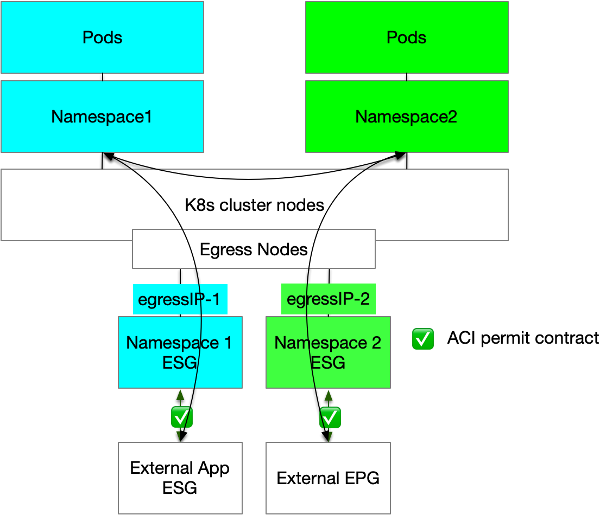


This is a common section for both the simplicity and advanced design


## Cilium Egress design

When it comes to the Cilium Egress design, the only consideration is how many `egress nodes` to deploy and whether to dedicate them only for this purpose.
Ideally, the design should have a minimum of two `egress nodes` distributed between two pairs of leaves. This will provide redundancy in case of `egress nodes` or ACI leaf failure or during upgrades.
Depending on the cluster scale and application requirements, dedicated `egress nodes` could be beneficial for the same reasons discussed for the `inress nodes`.

{: .note }
A single ingress node can be configured with multiple IP addresses, enabling it to support multiple PODs identities. This configuration allows us to efficiently reuse the same node across different namespaces. For example, IP-A can be associated with Namespace A, while IP-B can be linked to Namespace B, and so forth.

### Egress Gateway and ACI
{: .no_toc }
We can harness the capabilities of ACI Endpoint Security Groups (ESGs) to develop an efficient network design with the following structure:

* Dedicated ESG for Egress Gateway Traffic: The nodes performing egress will be configured with an additional Subnet that can be then classified into ESGs 
* Cilium Egress Gateway Policies: Implement Cilium Egress Gateway policies to associate specific namespaces with designated gateway nodes, each with a fixed egress IP address. This mapping ensures consistent and predictable IP addresses for the Outbound cluster traffic.
* ESG Classification on Egress IPs: Apply ESG classification to the egress IPs to streamline network management and policy enforcement, enhancing the security and control over outbound traffic at a namespace level. 

It is important to note that this design specifically addresses traffic leaving the cluster. Internal cluster traffic will remain unaffected by these configurations. This ensures that while outbound traffic is tightly controlled and secured, cluster-local communications continue to operate without interruption.

Egress Gateway traffic flows

{: .note}
The Egress Gateway feature can be configured to advertise the egress IP via BGP, which is a valid design choice. However, since ACI is limited to a maximum of 250 external EPGs per leaf per L3Out, it is more scalable to classify the egress IP within an ESG so that all the 250 available external EPGs can be used for Services.
