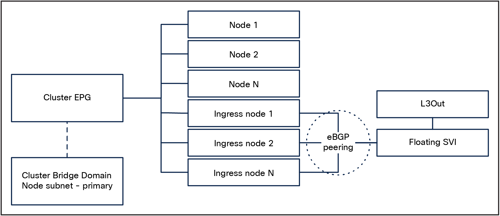
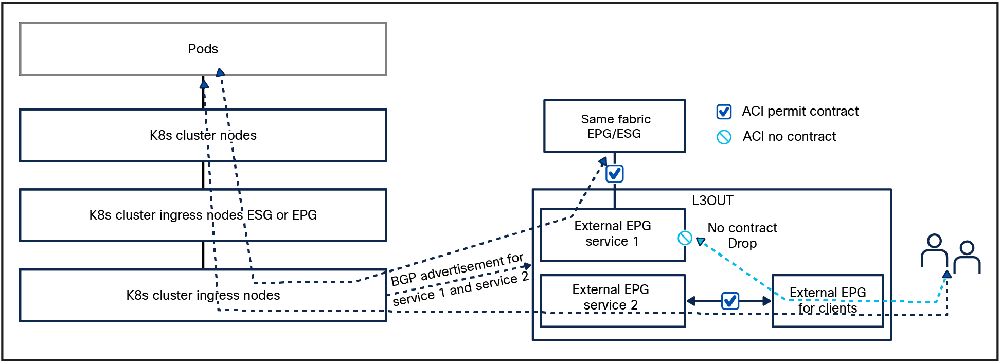

# Simplicity Design

The basic network infrastructure for our design will be composed of the following components:

* A tenant: The Kubernetes cluster can be placed in any dedicated, or a shared tenant for deployments with multiple clusters.
* One Bridge Domain (BD) for the Kubernetes cluster.
  * Configure the bridge domain with a primary subnet in the node subnet. This will be the default gateway for the Kubernetes nodes.
  * Configure the bridge domain with one or more secondary subnets. These subnets will be used for the Egress Gateways traffic.
* Create one EPG for the Kubernetes nodes primary interface.
* Create a `node` ESG: The ESG selector will be the `Node Subnet` so that all the nodes will be grouped in the same ESG.
* Create additional `egress` ESG: The ESG selector will be the `Egress IP` used to classify the source pod Identity.
* One Floating SVI L3Out L3Out running BGP for the ingress nodes.

This basic design gives us the following capabilities:

* Secure the traffic initiated by the Kubernetes nodes with ACI contracts.

    {: .note }
    Cilium offers the capability to implement micro-segmentation rules (via [CiliumNetworkPolicies](https://docs.cilium.io/en/latest/security/policy/index.html)) directly within the cluster. However, the specifics of its design and configuration fall outside the scope of this document.

* Secure the traffic initiated by POD natted to an Egress IP with ACI contracts.
* DHCP relay support: This design allows the Kubernetes nodes to be bootstrapped without the need to manually configure their IP addresses easing the cluster bootstrap and horizontal scalability. 

    {: .note }
    Remember to set the node subnet as “Primary” as DHCP relay packets are forwarded only for this subnet.

* Visibility of the node IP
* The nodes can be of any type and can be mixed: you can have a cluster composed of bare-metal hosts and VMs running on any hypervisor as long as network connectivity is provided.

* Routing simplicity: the node default gateway is the ACI node subnet SVI IP.
* BGP based ECMP for External K8s service Load Balancing 

## Cluster EPG physical connectivity

There is no strict requirement of the physical connectivity for the cluster EPG as long as it provides the required redundancy level. Most designs are likely to lean toward a vPC based design. Having L2 redundancy improves failover times as there is no need to wait for BGP convergence.

## Selective BGP peering for service advertisement

In this design, a dedicated L3Out is created in ACI for external service advertisement for a subset of Kubernetes nodes that will be, from now on, be called `ingress nodes`.

These nodes will be configured with two interfaces. It is convenient to keep the `ingress nodes` in the cluster EPG, because it simplifies node-to-node communication and allows the use of DHCP relay for node provisioning.

*Selective BGP peering design*

By default traffic received on the ingress nodes from the L3Out would be returned to the client via the Node's primary interface, resulting in the traffic being dropped.
To ensure return traffic is routed back to the L3OUT we can do the following on the ingress nodes:

* Create a new route-table ID, for example "100"
* In route table 100, add a default route pointing to the floating SVI secondary address or the BD SVI
* Use ip rules so that traffic that is sourced from either of the following
  * the service interface IP address
  * the service IP pool 
  is going to use route table 100, thus ensuring that traffic will be sent back to the L3Out via the second interface, which preserves routing symmetry.

Cilium BGP Control Plane traffic flows

{: .note }
For the nodes with multiple network interfaces is fundamental to ensure that the kubelet’s node-ip is set correctly on each node. In the Simplicity Design this has to be the Interface placed in the ACI EPG.
Cilium does not have the ability to chose which interface is used for pod to pod E/W routing and will use the kubelet’s node IP.

Refer to the [ACI BGP Design](/cilium-dc-design/docs/aci/aci_bgp_design/) section for details on how to configure ACI.

## Cilium BGP design

When it comes to the Cilium BGP design, the only consideration is how many `ingress nodes` to deploy and whether to dedicate them only for this purpose.

Ideally, the design should have a minimum of two `ingress nodes` connected to a pair of ACI leaf switches. This will provide redundancy in case of `ingress nodes` or leaf failure, scheduled maintenance, and during upgrades.

Depending on the cluster scale and application requirements, dedicated `ingress nodes` could be beneficial for the following reasons:

* Deterministic latency: if no Pods are running on the `ingress nodes` all the ingress traffic go through two hops ensuring deterministic latency.
* Limit the number of `ingress nodes`: By having dedicated `ingress nodes`, we can ensure that all the bandwidth and compute are dedicated to the ingress function.
* Reduced number of BGP peerings. As only a subnet of nodes establish BGP peering with the fabric, the management overhead is reduced.

* Specialized hardware: not all the nodes in a Kubernetes clusters need to be the same; specialized high-performance hardware can be utilized for our `ingress nodes`. For example, thanks to [CiliumNodeConfig](https://docs.cilium.io/en/latest/configuration/per-node-config/#per-node-configuration), we can deploy bare-metal nodes with either Mellanox or Intel network interface cards and achieve 100+ Gbps throughput per ingress node, thanks to [Cilium Big TCP](https://docs.cilium.io/en/stable/operations/performance/tuning/#ipv4-big-tcp) capability.

Refer to the [Example configuration](../examples/examples/) section of this document for implementation details.



## Design trade offs

This design aims to provide you with an easy and high scalable design; however, it comes with the following drawbacks:

1. External services can only be advertised as “Cluster Scope”: since all the incoming traffic has to pass through a subset of Kubernetes nodes, we need to be able to perform a second-stage load balancing to reach the “correct” node.
2. Potential bottle necks for ingress/egress traffic
3. BGP cannot be used to advertise the Pod subnets.
4. Ingress nodes have two interfaces with different route tables, this adds additional complexity.

For issue (1) there is no solution; this is a trade-off we make to achieve a more scalable and simple design. Issue (2) can be easily addressed with either vertical or horizontal scaling.

Issue (3) can be addressed with Cilium Egress Gateway.

[Next](/cilium-dc-design/docs/aci/advanced_design/){: .btn }
{: .text-right }